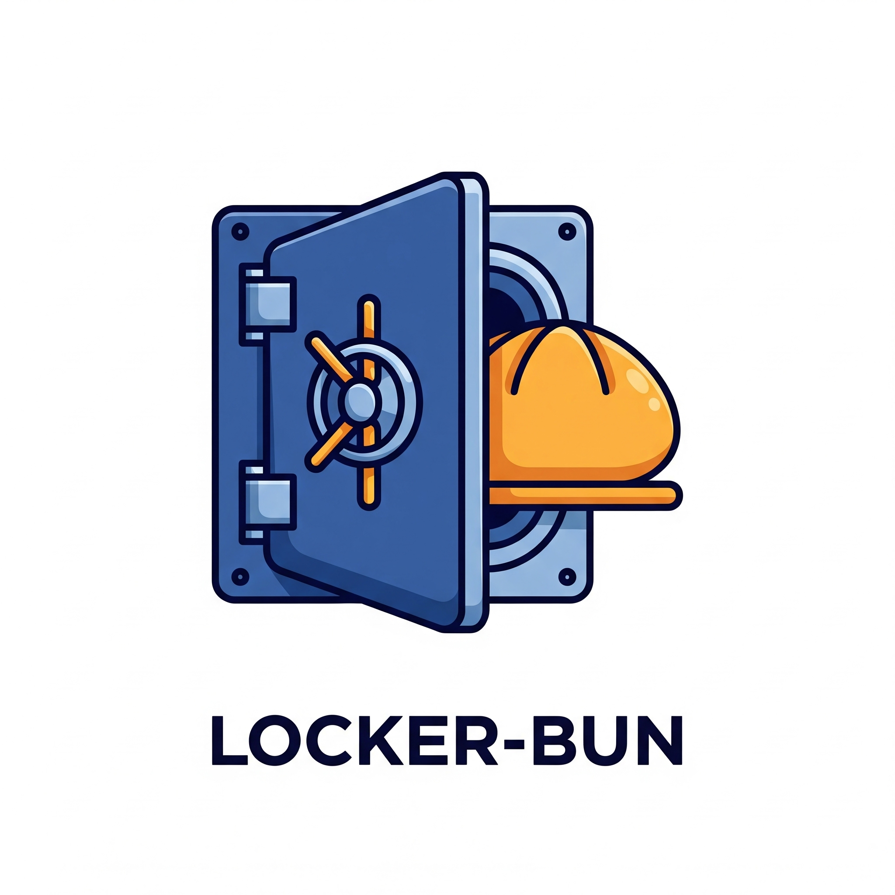
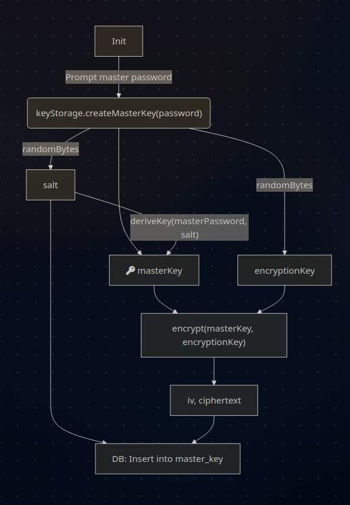
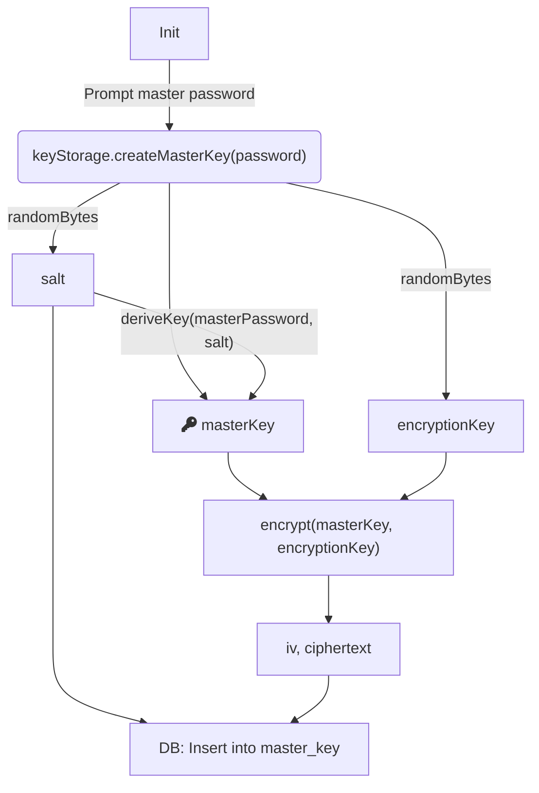

<p align="center">
  
</p>

# locker-bun

It's a PoC Password Manager written with Bun

- 🔐 A `logins.json` file (stores encrypted credentials)
- 🗄 A SQLite database (`key.db`) to store the encryption key (which will itself be encrypted)
- 🔑 A master password (used to unlock the encryption key)
- ⚙️ Built with Bun (JavaScript runtime with modern performance and batteries-included)

## Running

### To install dependencies:

```bash
bun install
```

### To run:

```bash
bun run src/index.ts init        # sets master password, generates key
bun run src/index.ts add         # prompts to add a login
bun run src/index.ts get github.com  # fetches login for github.com
```

## Mermaid flows:

### Init




